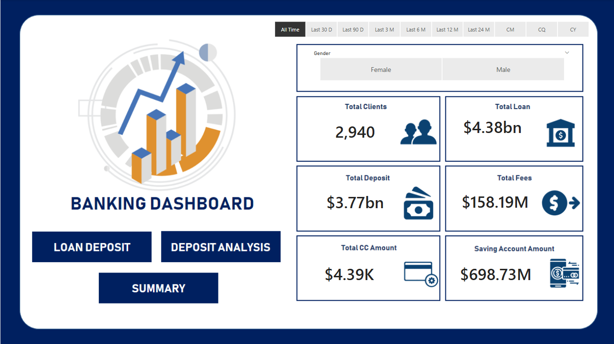
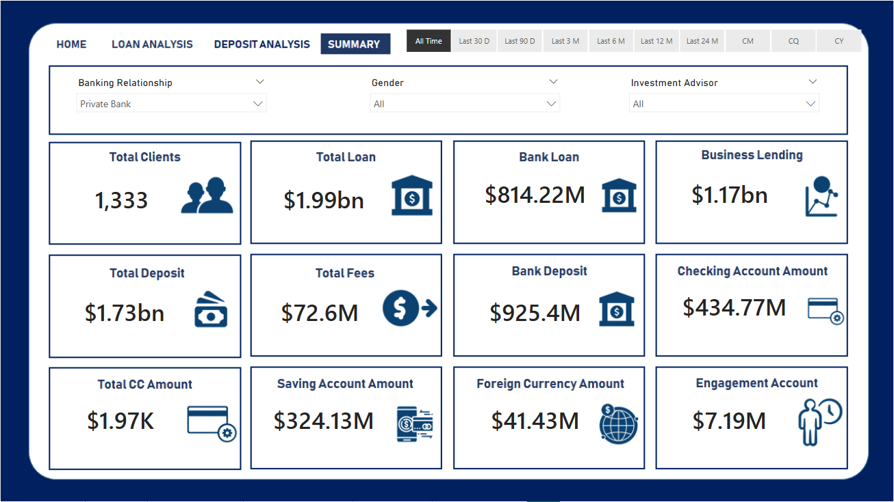

# Banking Analytics Dashboard — End-to-End Data Analysis

An end-to-end banking analytics project that transforms customer-level banking data into a management-ready view of **customer scale, deposits, lending exposure, relationship balances, and portfolio mix**.

The project follows a decision-oriented workflow:

**Raw Banking Data → Data Quality → SQL Transformation → EDA → KPI Layer → Power BI Dashboard → Business Insights**

---

## 1. Business Objective

The dashboard is designed to answer four practical banking analytics questions:

1. **Customer base** — How large is the customer portfolio and how is it distributed?
2. **Deposits & liquidity** — Where is customer liquidity concentrated across deposit-related balances?
3. **Lending** — How large is the loan portfolio and how does lending exposure vary across customer groups?
4. **Relationship value** — How do income, loyalty, fee structure, cards, deposits, and lending exposure vary together?

This positions the project as an **analytics and decision-support case study**, rather than only a dashboard-building exercise.

---

## 2. Dataset & Data Grain

The supplied `Banking.csv` contains:

- **3,000 source records**
- **25 columns**
- **2,940 distinct Client IDs**
- No exact duplicate rows
- 60 additional records associated with repeated Client IDs

Because the source contains repeated Client IDs, customer-level KPIs use **DISTINCT Client ID** rather than raw row count.

### Key analytical fields

**Customer attributes**
- Client ID
- Age
- Nationality
- Occupation
- Gender ID
- Joined Bank
- Location ID

**Relationship attributes**
- Fee Structure
- Loyalty Classification
- Amount of Credit Cards
- Properties Owned

**Financial attributes**
- Estimated Income
- Superannuation Savings
- Credit Card Balance
- Bank Loans
- Bank Deposits
- Checking Accounts
- Saving Accounts
- Foreign Currency Account
- Business Lending

**Risk / organizational dimensions**
- Risk Weighting
- BRId
- IAId

---

## 3. Data Quality & Preparation

The analytical workflow includes validation before KPI reporting.

### Data-quality checks

- Source record count vs distinct customer count
- Repeated Client ID detection
- Missing values in key analytical fields
- Zero-balance exposure checks
- Exact duplicate validation

### Transformation

Categorical fields are standardized and coded dimensions are mapped to readable labels where mapping information is available.

Income is grouped into analytical bands such as:

- Low
- Mid
- High

The detailed SQL checks are available in:

`sql/01_data_quality_checks.sql`

---

## 4. Analytical Framework

The project organizes analysis into four management views.

### A. Customer Overview

Understand the scale and composition of the customer base using:

- Distinct customers
- Estimated income
- Credit-card relationships
- Properties owned
- Loyalty classification
- Fee structure
- Nationality
- Gender
- Risk weighting

### B. Deposit & Liquidity Analysis

Analyze:

- Bank Deposits
- Checking Accounts
- Saving Accounts
- Foreign Currency Account
- Total relationship balances
- Deposit concentration across customer segments

### C. Lending Analysis

Analyze:

- Bank Loans
- Business Lending
- Customers with loan exposure
- Customers with business-lending exposure
- Loan-to-deposit relationship
- Lending exposure across loyalty, fee, income and risk dimensions

### D. Customer Relationship Analysis

Examine relationships between:

- Income
- Loyalty
- Deposits
- Lending
- Credit cards
- Properties
- Fee structure
- Risk weighting

---

## 5. KPI Framework

The dashboard uses reusable measures rather than relying only on visual-level calculations.

### Customer KPIs

- **Distinct Customers**
- **Source Records**
- **Average Estimated Income**
- **Average Credit Cards**
- **Average Properties Owned**

### Deposit / Liquidity KPIs

- **Total Bank Deposits**
- **Total Checking Accounts**
- **Total Saving Accounts**
- **Total Foreign Currency**
- **Total Relationship Balances**
- **Average Bank Deposit per Customer**

### Lending KPIs

- **Total Bank Loans**
- **Total Business Lending**
- **Loan Customers**
- **Business Lending Customers**
- **Loan-to-Deposit Ratio**

### Portfolio KPIs

- Fee Structure mix
- Loyalty Classification mix
- Risk Weighting mix
- Gender mix
- Nationality mix
- Branch mix

The proposed Power BI measure layer is documented in:

`dashboard/KPI_Measures.md`

---

## 6. Power BI Dashboard

The dashboard is organized into four analytical pages:

### 1. Executive Overview

High-level view of customer scale, financial exposure and portfolio composition.

### 2. Loan Analysis

Explores bank-loan and business-lending exposure across customer and portfolio dimensions.

### 3. Deposit Analysis

Explores deposits, checking, savings and foreign-currency balances and their distribution.

### 4. Portfolio Summary

Brings together key relationships, correlations and demographic/portfolio patterns.

---

## 7. Analytical Insight

EDA identifies a strong positive relationship among:

- Bank Deposits
- Checking Accounts
- Saving Accounts
- Foreign Currency Account

This indicates that customers with higher balances in one relationship account type also tend to hold higher balances across other account types.

**Business implication:** relationship depth can be analyzed across multiple balance categories rather than evaluating individual account balances in isolation.

The interpretation is descriptive; the dataset does not contain transaction timestamps, revenue, cost or profitability fields, so the project does not claim customer activity, profitability, default or NPL performance.

---

## 8. Technical Architecture

```text
                    Banking.csv
                         |
                         v
                 Data Quality Checks
                         |
                         v
                 SQL Transformation
                         |
                         v
                    EDA / Profiling
                         |
                         v
                 Analytical Data Layer
                         |
                         v
                  KPI / DAX Layer
                         |
                         v
                 Power BI Data Model
                         |
                         v
                  Interactive Dashboard
                         |
                         v
                 Business Interpretation
```

---

## 9. Tools & Technologies

- **SQL / MySQL** — data preparation, validation and analytical querying
- **Power BI** — interactive dashboard and reporting
- **DAX** — reusable KPI and analytical measures
- **Python / Jupyter** — exploratory data analysis
- **Git / GitHub** — version control and project documentation

---

## 10. Repository Structure

```text
Bank-Dashboard-Analysis/
├── assets/
│   └── screenshots/
├── dashboard/
│   ├── Banking_Dashboard.pbix
│   └── KPI_Measures.md
├── data/
│   └── Banking.csv
├── docs/
│   └── analytical_framework.md
├── notebooks/
│   └── BankEDA.ipynb
├── sql/
│   └── 01_data_quality_checks.sql
├── requirements.txt
├── LICENSE
└── README.md
```

---

## 11. Project Outcome

The project demonstrates an end-to-end analyst workflow:

**Data Quality → SQL → EDA → Data Modeling → KPI Design → BI Reporting → Business Insight**

The emphasis is on turning raw banking data into structured information that can support customer, deposit, lending and portfolio analysis.

---

## Dashboard Screenshots

### Executive Overview


### Loan Analysis


### Deposit Analysis


### Portfolio Summary


---

## License

MIT License.
